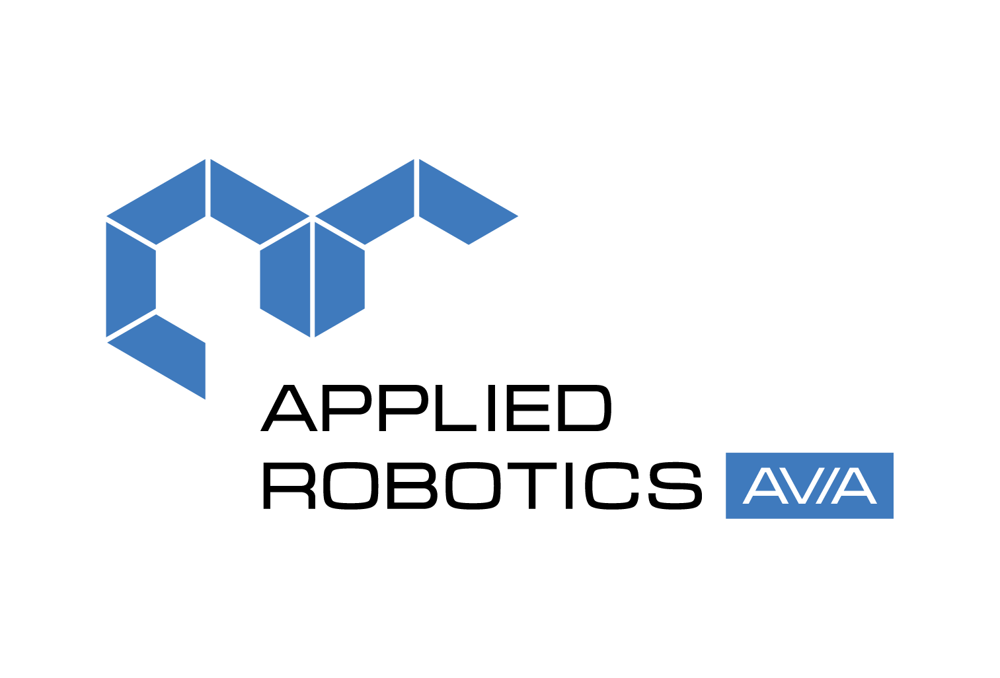

  

<h1 style="text-align: center;">ARA Mini ESP32 Package</h1>

  

### Краткое описание

Данный пакет представляет собой програмное обеспечение беспилотного авиационного средства **Applied Robotics AVIA Mini**. Функции, предоставляемые пакетом:

- WEB-приложение для управления 4-мя каналами согласно раскладке AETR (Aileron - крен, Elevator - тангаж, Altitude - газ, Rudder - рысканье)
- Отображение изображения с камеры ARA Mini
- Переключение навигационных режимов
- Включение и выключение двигателей

### Использование

После обновления прошивки ESP32 на ARA Mini необходимо подключиться к WiFi **ARA-Mini_1**, используя пароль **12345678**. Затем нужно открыть браузер на мобильном устройстве или на персональном компьютере и вбить адрес, который используется для подключения к WEB-интерфейсу, **http://192.168.2.113:8775/**
